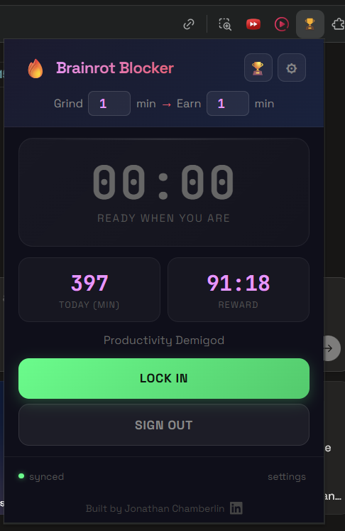
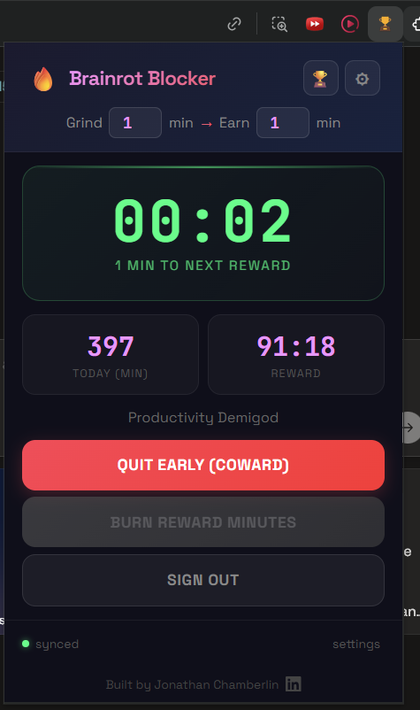
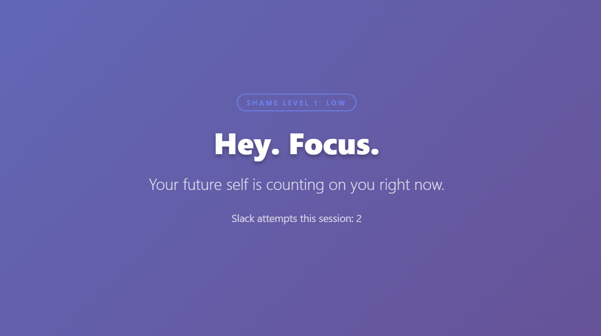

# Brainrot Blocker

**A site blocker that fights back.**

Brainrot Blocker is a Chrome extension that locks distracting sites during timed "Lock In" sessions, earns you reward minutes for real work, and roasts every cheat attempt with escalating shame GIFs — then ranks your focus streak on a competitive leaderboard.

Built for students, founders, and anyone who swears they'll work but doomscrolls instead.



---

## Why This Exists

One "quick" YouTube video turns into 30–60 minutes, twice a day. Over a year, that's **700+ hours** — 18 full-time workweeks — gone to distraction.

Most site blockers are passive. They show a polite message you dismiss in seconds. Brainrot Blocker creates real emotional friction: escalating shame, public accountability, and sessions you literally can't quit early.

---

## How It Works

1. **Lock In** — Click the button to start a work session. Reward sites (YouTube, Reddit, Instagram, etc.) are instantly blocked.
2. **Earn reward time** — The work timer only counts when you're on a productive tab. Every 50 minutes of real work earns 10 minutes of reward time (configurable).



3. **Burn reward time** — Spend your banked minutes on reward sites. The countdown only ticks while you're actually on those sites. Pause it, save it, use it later.


4. **Get shamed** — Try to visit a blocked site and the extension escalates through 4 levels of shame, from *"Hey. Focus."* all the way to *"DEFCON 1: TOTAL SHAME MELTDOWN"* complete with dramatic chipmunk GIFs and asteroids hitting Earth.

|  |  |  |  |
|:---:|:---:|:---:|:---:|
| Level 1: Low | Level 2: Medium | Level 3: High | Level 4: Maximum |
5. **Compete** — A leaderboard ranks users by productive minutes and how many times they tried to slack off.

### Strict Mode

Toggle Strict Mode on and you **cannot** end your session until you hit the work threshold. No override, no escape hatch.

### Early Exit Penalty

Want to quit early? Configure a donation to a charity you love — or one you hate — to make walking away cost something real.

### Productivity Check

Spend too long on one site during a work session? After 10 minutes on the same website, a popup asks: *"Are you really working right now?"* Answer honestly — if you say no, that site gets added to your blocked list automatically.

---

## Tech Stack

| Layer | Technology |
|-------|-----------|
| Extension | Chrome Manifest V3, vanilla JS/CSS |
| Blocking | `declarativeNetRequest` API with rule priorities |
| Backend | Node.js + Express |
| Auth | Auth0 (Google OAuth) |
| Leaderboard API | JWT-secured REST endpoints |
| Data | JSON file storage |

The UI was built from scratch — dark theme, Space Grotesk font, neon green and orange accents, animated confetti on reward grants, and a settings page that locks itself mid-session so you can't cheat.

---

## Install

1. Clone this repo
2. Open `chrome://extensions` and enable Developer Mode
3. Click **Load unpacked** and select the project root
4. Click the Brainrot Blocker icon and hit **Lock In**

For the leaderboard backend:

```bash
cd server
npm install
cp .env.example .env   # add your Auth0 credentials
node server.js
```

---

## Project Structure

```
├── manifest.json          # Chrome extension manifest (V3)
├── background.js          # Service worker: session state, timers, blocking rules
├── popup.html/js/css      # Main extension popup UI
├── settings.html/js/css   # Configuration page
├── blocked.html/js/css    # Shame escalation page
├── leaderboard.html/js    # Competitive rankings
├── overview/              # Project narrative and pitch
│   ├── project_story.md
│   └── pitch.md
└── server/                # Backend API
    ├── server.js
    └── data/db.json
```

---

## What's Next

- another judge said that there should be more options of websites that are distracting on the default page.
- Wyatt said that it would be useful if he could use the steam application as a break. To do this I would have to make it so the extension can block applications, not just track time spent on them.
- in the settings page, instead of there being a different save button for each setting, there should be one saved button that appears as a banner on the bottom of the screen that scrolls with your window so it stays at the bottom.
- add a category on productive sites for music and music production
- Chrome Web Store deployment

- Wire the frontend leaderboard to the live backend API
- Streak tracking — consecutive days hitting your work target
- Team competitions so friend groups can shame each other
- Behavioral analytics dashboard showing distraction patterns over time
- Real payment integration for early-exit penalties

---

*Built solo at HackBeanpot (Northeastern University) in 36 hours.*
