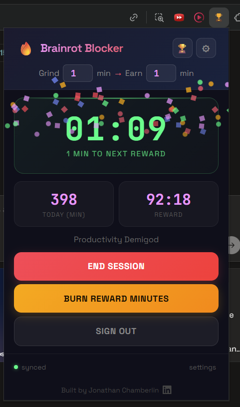
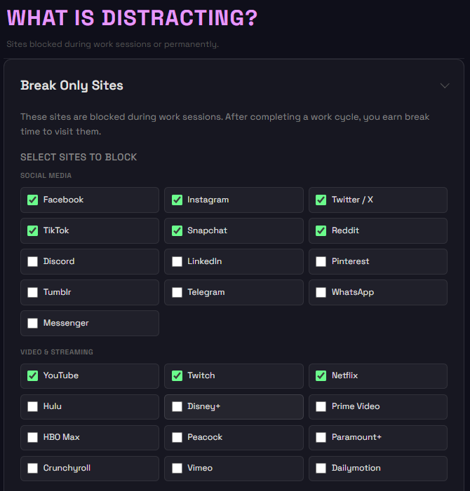
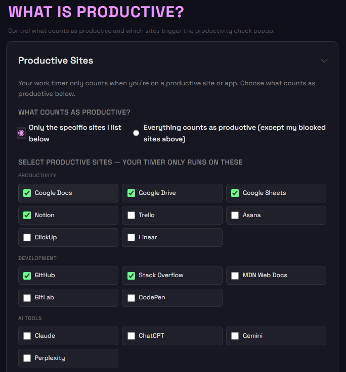

# Brainrot Blocker

A site blocker that fights back.

Brainrot Blocker is a Chrome extension that locks distracting sites during timed "Lock In" sessions, earns you reward minutes for real work, roasts every cheat attempt with escalating shame GIFs, and gives you a nuclear option for sites you never want to visit again.

➡️ DOWNLOAD NOW: 
https://chromewebstore.google.com/detail/brainrot-blocker/cijlhepnapgbpnfjgbbepimgcaindalj?utm_source=item-share-cb


Built for students, founders, and anyone who swears they'll work but doomscrolls instead.


---

## Why This Exists

One "quick" YouTube video turns into 30 to 60 minutes, twice a day. Over a year, that's 700+ hours gone to distraction, which is 18 full-time workweeks.

Most site blockers are passive. They show a polite message you dismiss in seconds. Brainrot Blocker creates real emotional friction: escalating shame, sessions you literally can't quit early, and a permanent nuclear option for your worst habits.

---

## Features

### Lock In Sessions

Click Lock In to start a work session. Every site on your blocked list is instantly locked. The work timer only counts when you're on a productive tab. Navigate away and it pauses.


### Earn and Burn Reward Time

Every completed work cycle (default: 50 minutes) earns break time (default: 10 minutes). Hit Use Break Time to unlock reward sites for exactly that long. The countdown only ticks while you're on those sites, and you can pause it and save what's left.




### Escalating Shame System

Try to visit a blocked site and the extension escalates through 4 levels of shame, from a gentle nudge to total meltdown.

|  |  |  |  |
|:---:|:---:|:---:|:---:|
| Level 1: "Hey. Focus." | Level 2: Getting dramatic | Level 3: Full meme mode | Level 4: DEFCON 1 |

Each visit attempt is counted. Level 4 has dramatic chipmunk GIFs, asteroids, and the message: "TOTAL SHAME MELTDOWN."

---

### Nuclear Block

For sites you genuinely never want to visit. Not during breaks, not ever.

Nuclear Block is a permanent, hard-to-reverse layer of blocking with a staged cooldown system designed to make impulsive unblocking impossible:

1. Add a site. Choose how long you need to wait before you can even request unblocking (up to 1 year).
2. First cooldown. The site is locked for the duration you chose. Waiting is the point.
3. Request unblock. Once the first cooldown expires, an Unblock button appears alongside a Block Again dropdown if you change your mind.
4. Second cooldown. Clicking Unblock starts a second confirmation wait (20 minutes to 30 days, default 18 hours).
5. Site removed. The site unblocks only after both cooldowns pass.

These sites remain blocked if you use **Delete All Data** in Settings (Nuclear Block entries are intentionally preserved by that action).

Preset nuclear sites included: OnlyFans, Adult Websites (35+ domains), Gambling Sites (26+ domains), Steam, Epic Games, League of Legends, World of Warcraft, Valorant.


---

### Productivity Check Popup

Spend more than 10 minutes on the same site during a session and a popup appears: "Are you really working right now?"

- "Yes, I'm working" approves the site so the popup never shows again for it.
- "No, block this site" adds the site to your blocked list automatically.

---

### Strict Mode

Toggle Strict Mode and you cannot end your session until you hit the work threshold. No override. No escape hatch. The End button is disabled until you've earned at least one reward cycle.

---

### Early Exit Penalty

Quitting early? Configure a financial penalty: donate to a cause you support, or one you oppose for stronger motivation. Penalty amount and target organization are fully configurable. Currently honor-system, with real payment integration on the roadmap.

---

### Companion App: Desktop App Tracking

Enable Companion App mode (requires native host installation) to extend blocking and time tracking beyond the browser:

- Productive desktop apps: Visual Studio Code, Figma, Ableton, FL Studio, and 100+ others. Your work timer runs while these are in the foreground.
- Blocked desktop apps: Specify apps that get closed during work sessions (Steam, games, etc.).
- Custom entries: Add any app by process name.

---

### Settings

All settings are organized into collapsible sections. Click any heading to expand it.


Sessions
- Work duration (1 to 180 min, default 50)
- Break duration (1 to 60 min, default 10)
- Strict Mode toggle

What is Distracting?
- Break Only Sites: blocked during sessions, accessible during breaks (50+ presets by category)
- Custom blocked domains and allowed path exceptions
- Nuclear Block: permanent blocking with staged cooldown removal



What is Productive?
- Productive Sites: whitelist mode or "everything except blocked" mode
- Custom productive domains
- Skip Productivity Check: approved sites that never trigger the popup



Desktop App Tracking (Companion App mode)
- Productive Applications: desktop apps that count as work time
- Blocked Applications: apps closed during sessions

Penalty
- Financial Penalty toggle (on/off)
- Penalty type, target organization, amount, reminder note

---

## Tech Stack

| Layer | Technology |
|-------|------------|
| Extension | Chrome Manifest V3, vanilla JS |
| Blocking | `declarativeNetRequest` API (rule priority system) |
| Background | Service worker with modular importScripts |
| Desktop tracking | Chrome Native Messaging |
| Backend | Node.js + Express |
| Auth | Auth0 (Google OAuth) |
| Leaderboard | JWT-secured REST endpoints |
| Storage | chrome.storage.local + JSON |

Blocking uses three priority tiers: session blocks (1), allow-path rules (2), and Nuclear Block (3). Nuclear rules always win.

---

## Install

1. Clone this repo
2. Open `chrome://extensions` and enable Developer Mode
3. Click Load unpacked and select the `extension/` folder
4. Click the Brainrot Blocker icon and hit Lock In

---

## Project Structure

```
extension/
├── manifest.json           # Chrome MV3 manifest
├── background.js           # Service worker orchestrator
├── constants.js            # Preset sites, app lists, defaults
├── session.js              # Session start/end/quit logic
├── session-state.js        # State object and flush functions
├── timer.js                # Millisecond-precision timer utilities
├── blocking.js             # declarativeNetRequest rule management
├── nuclear-block.js        # Nuclear Block rules and cooldown logic
├── reward.js               # Reward grant and countdown logic
├── tab-monitor.js          # Active tab and app focus tracking
├── native-host.js          # Desktop app communication
├── productivity-check.js   # Content script for the "Are you working?" popup
├── popup.html/js           # Main extension popup
├── settings.html/js        # Settings page
├── blocked.html/js         # Shame escalation page
├── nuclear-blocked.html/js # Nuclear Block redirect page
└── leaderboard.html/js     # Competitive rankings

server/
├── server.js               # Express API
└── data/db.json            # User and session data
```

---

## Roadmap

- Real payment integration for early-exit penalties
- Wire frontend leaderboard to live backend
- Streak tracking: consecutive days hitting your work target
- Team competitions: friend groups that shame each other
- Behavioral analytics dashboard showing distraction patterns over time
- Chrome Web Store deployment

## What's Next?
- Implement leaderboards
- Ensure that data is retained between accounts when signing in.


---

*Built solo at HackBeanpot (Northeastern University) in 36 hours. Significantly expanded since.*
